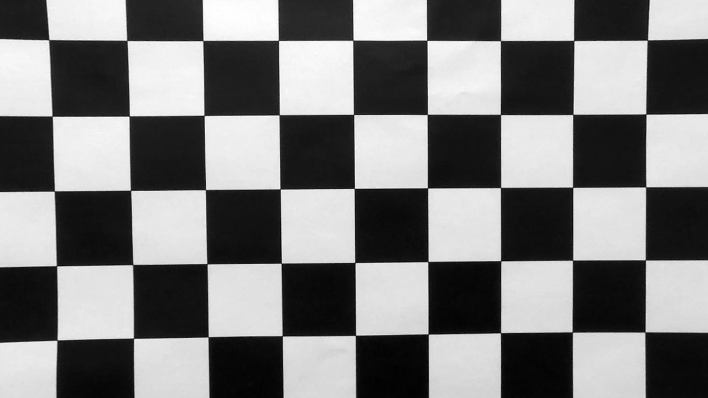
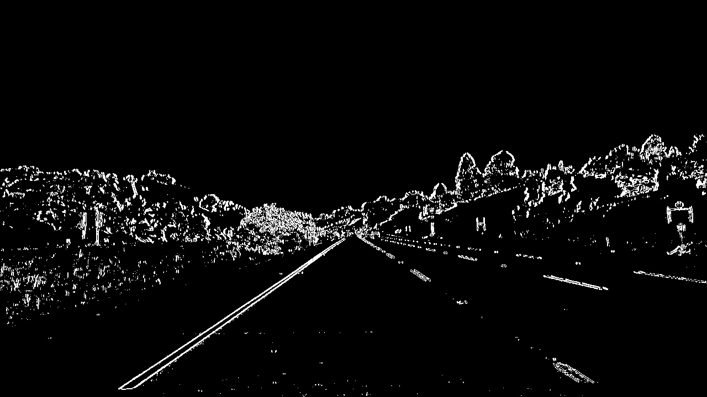
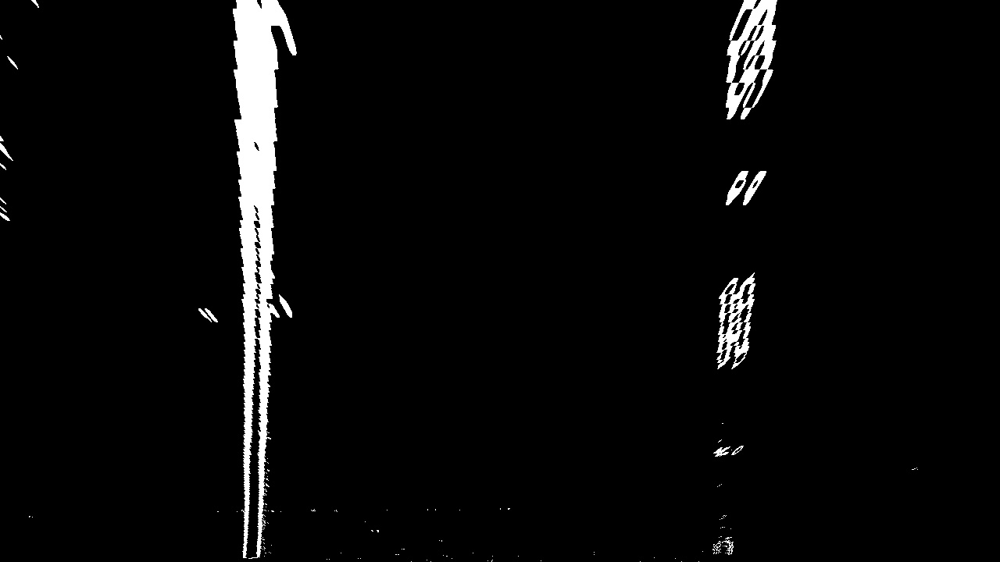
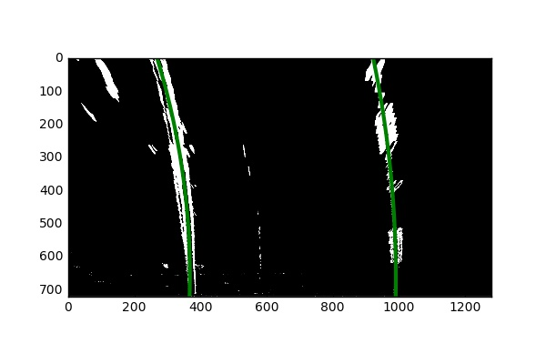
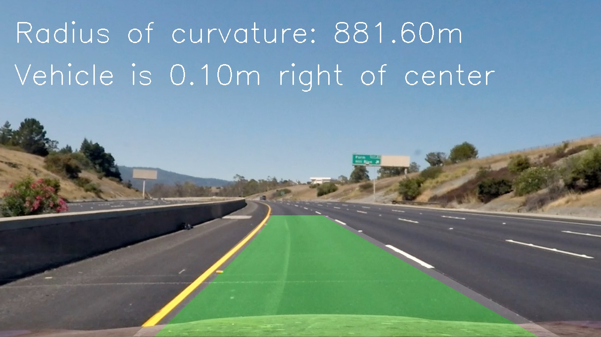

## Advanced Lane Finding

Code for this project is in the ./AdvLaneLines.ipynb notebook.

### Camera Calibration

**Briefly state how you computed the camera matrix and distortion coefficients. Provide an example of a distortion corrected calibration image.**

The code for the camera calibration is in the section titled **Step 1: Camera Calibration**. The steps to calibrate the camera is as follows:

* Calibrate on a set of chess board images
* Track the corners of the chess board in the real world in an object points array (objpoints). This is a 3-dimensional object (x, y, z), with the z plane = 0. The xy-plane is a 6x9 grid.
* Detect the corners of the chess board in the images using the OpenCV findChessboardCorners() function. Store the detected corners in the image points array (imgpoints).
* Once we have the objpoints and imgpoints for all the calibration images, calculate the distortion coefficients using the calibrateCamera() function. These coefficients are then used to undistort an image using the OpenCV undistort() function. 

Original image

Image after undistort

### Pipeline (test images)

**Provide an example of a distortion-corrected image.**

Here is an example of an image before and after distortion correction has been applied to it:

Original image

Image after distortion correction
  

**Describe how (and identify where in your code) you used color transforms, gradients or other methods to create a thresholded binary image. Provide an example of a binary image result.**

I used a combination of gradient and color threshold to create a binary image. The code for thresholding is in the section titled **Step 3: Color & Gradient Threshold** in the notebook.

Binary image

**Describe how (and identify where in your code) you performed a perspective transform and provide an example of a transformed image.**

The code for performing a perspective transform is in the the section titled **Step 4: Perspective Transform** in the notebook. The process consists of identifying four source points of a polygon and setting their coordinates in the destination image. The getPerspectiveTransform() function computes the perspective transform that can then be used to transform an image's perspective using the warpPerspective() function.

Perspective transform of the binary image above

**Describe how (and identify where in your code) you identified lane-line pixels and fit their positions with a polynomial?**

The code for identifying lane-line pixels in in the section titled **Step 5:  Lane Lines - Detect Lines**.
I used the histogram and sliding window method (as described in lesson 33) to find the lane pixels. Here is a summary of the logic I used to identify lane pixels:

* 	Once a lane has been detected, then in the next frame I identify the lane pixels as long as they are within an offset of the pixels in the previous frame. 
*  I validate if the detected line is likely to be the actual line by checking if the right and left lines are close to parallel (check the horizontal distance between the lines at different y-coordinates e.g. near the top and bottom) and if the slope of the lines are close. 
*  If the lines are not valid, I use an average of the 5 previous valid frames to infer the lines.
*  If more than 5 frames have invalid data, I go back to searching for the lines via the histogram/sliding window method. 

Here is a sample of fitting a polynomial curve on the detected lines.

**Describe how (and identify where in your code) you calculated the radius of curvature of the lane and the position of the vehicle with respect to center.**

The code to calculate the curvature of the lane lines and the offset of the vehicle from center is in the sections **Step 5:  Lane Lines - Calculate Curvature** and **Step 5:  Lane Lines - Draw Lane**.   
To calculate the offset from center I perform the following steps:  
* 	Knowing the x-coordinates of the left and right lines near the bottom of the image, I calculate the x-coordinate of the center of the lane.  
*  Assuming the camera is at the center of the image, I detect the x-coordinate difference between the center of the image and the center of the lane (center of image - center of lane). If the offset is negative, the vehicle is to the left of center, right otherwise. I also convert the pixel difference to meters.

The radius calculation of a line is in the _calculateCurvature() function.

### Pipeline (video)
**Provide an example image of your result plotted back down onto the road such that the lane area is identified clearly.**

Here you go.

**Provide a link to your final video output. Your pipeline should perform reasonably well on the entire project video (wobbly lines are ok but no catastrophic failures that would cause the car to drive off the road!)**   

[Project 4 Output Video](./project_video_output.mp4)

### Discussion
**Briefly discuss any problems / issues you faced in your implementation of this project. Where will your pipeline likely fail? What could you do to make it more robust?**

It is hard to detect lanes in the following situations:

* Images that are too bright/dark or images where there is excessive glare.
* Images with sharp turns.
* Images with unclear lane markings (e.g. only a shoulder without a marked line).

Some thoughts on how to make it more robust:

* 	Better image processing to rule out hot pixels
*  Additional validation of pixels before adding it to a lane. 

